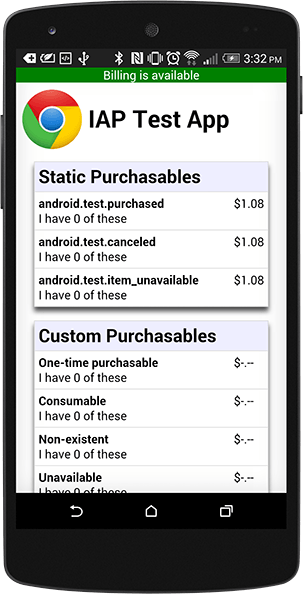

# In-App Purchases Test App

This app provides test purchases for Android and iOS based on the [google.payments chorme-cordova plugin](https://github.com/MobileChromeApps/mobile-chrome-apps/tree/master/chrome-cordova/plugins/google.payments).

Users can purchase consumable and non-consumable products and attempt to purchase non-existent and unavailable products.

Additionally, on Android, users can buy test products provided by Google. (The "Static Purchasables" items are available to all Android applications, do not result in any actual credit card charges, and do not have to be configured in the Google Play store.) 

This is a Mobile Chrome App API demo -- there is a similar demo for desktop Chrome Apps at https://github.com/GoogleChrome/chrome-app-samples/tree/master/samples/in-app-payments, as part of the [Chrome App Samples](https://github.com/GoogleChrome/chrome-app-samples) collection.

## Preparation

### Android

To configure in-app purchasing on Android, you will need to be a registered developer on the Google Play store. See the [google.payments plugin documentation](https://github.com/MobileChromeApps/mobile-chrome-apps/blob/master/chrome-cordova/plugins/google.payments/README.md#configuration) for more details. Once you have the license key, you can add that to your manifest (or mobile manifest) for the `play_store_key`. 

The `skuMap` object in `iaptest.js` defines four products for Android. For the demonstration, they are set up in the Google Play store like this:

`org.chromium.iaptest.onetime`: Product, $0.99, available for purchase
`org.chromium.iaptest.consumable`: Product, $0.99, available for purchase
`org.chromium.iaptest.unavailable`: Product, $0.99, not available for purchase

The fourth product, `org.chromium.iaptest.nonexistent`, is not set up on the store. It is defined in `skuMap` so that you can see the server response when attempting to purchase a nonexistent product.

To use this app to test purchases from the store, you should set up similar products and edit the `skuMap` variable to include their product ids.

You can publish your app as an alpha or beta version and invite users to download it through a special link and test the purchase flow. Purchases made will be charged to the testers' accounts, but you can cancel them through the Google Wallet Merchant Center.

More details about [testing in-app billing on Android](http://developer.android.com/google/play/billing/billing_testing.html) are in the Android developer docs.

### iOS

In order to access Apple's in-app purchase sandbox, you must create a test user through your Apple Developer account.  Instructions on how to [set up test user accounts on iOS](https://developer.apple.com/library/ios/documentation/LanguagesUtilities/Conceptual/iTunesConnect_Guide/Chapters/SettingUpUserAccounts.html) can be found in the iOS developer docs.

## Using the App

On launch, you will be presented with a list of items to purchase.  Each item also lists how many have been previously purchased.

Tap an item to attempt to purchase it.  This will initiate the platform-specific purchase flow; follow the instructions to purchase the item.  If the purchase is successful, the corresponding counter will increase.

**Note:** Apple's in-app purchase sandbox is currently inaccessible due to technical issues, so product information retrieval and purchase attempts may fail.  [Updates on the iOS purchase sandbox](https://devforums.apple.com/thread/216969) can be found in the Apple developer forums.

## Purchase Persistence

All purchases are stored on the device using the chrome.storage API and will be fetched on subsequent runs.  

Consumable purchases are *not* synced across devices.

Non-consumable purchases are also not synced, but attempts to purchase one on another device (on the same platform) will notify you that the product has already been purchased and ask you to download it.

## Screenshot

